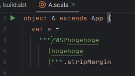
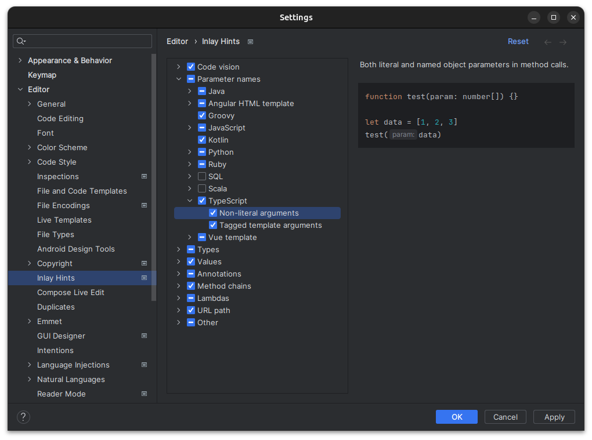

# 前提とするIDEとversion
```
IntelliJ IDEA 2023.2.2
```

# type hint
Ctrl + Shift + P
選択した値を評価し、型推論させて、型をツールチップで表示してくれます。
型推論がある言語（TypeScript, Kotlin, Scalaなど）で使えます。

# Jump to Line
矢印をドラッグ＆ドロップすると、前に巻き戻るデバッグも可能になる。
[Jump to Line \- IntelliJ IDEs Plugin \| Marketplace](https://plugins.jetbrains.com/plugin/14877-jump-to-line)

# Action on Save + File Watchers
外部ツールで、フォーマットをかけたい場合に使える。
File WatchersとAction on Saveを組み合わせる。

## File Watchers
[ファイル監視 \| IntelliJ IDEA ドキュメント](https://pleiades.io/help/idea/using-file-watchers.html)

`Auto-save edited file to trigger the watcher`のオプションを外すと、自動的に保存時にフォーマットがかかるのを防げる。
`Trigger the watcher on external changes`のオプションを外すと、外部から変更（IntelliJ以外から変更）によるトリガーが発動しなくなる。

## Action on Save
[変更の保存と復元 \| IntelliJ IDEA ドキュメント](https://pleiades.io/help/idea/saving-and-reverting-changes.html#actions-on-save)
Action on Saveで、File Watchersを実行するように設定ができます。

# 条件付きブレイクポイント
ブレイクポイントの赤丸を右クリックすると、ブレイクポイントに条件が付与できる

# ブラウザのJavaScriptのデバッグと連動
ブラウザでのデバッグと連動して、IntelliJ IDEAでのデバッグができる。
[Chrome での JavaScript のデバッグ \| IntelliJ IDEA ドキュメント](https://pleiades.io/help/idea/debugging-javascript-in-chrome.html)

# Local History
Gitのコミットを作成しなくても、Local Historyで変更履歴を残せる。
うっかり、消したとしても、Local Historyから復元できる。
[ローカル履歴 \| IntelliJ IDEA ドキュメント](https://pleiades.io/help/idea/local-history.html)

# ゼロ幅スペースも表示してくれる 
[ゼロ幅スペース](https://ja.wikipedia.org/wiki/%E3%82%BC%E3%83%AD%E5%B9%85%E3%82%B9%E3%83%9A%E3%83%BC%E3%82%B9) といった文字も表示してくれる


# GithubのPull Requestの閲覧
[File | Settings | Version Control | GitHub](jetbrains://idea/settings?name=Version+Control--GitHub)で設定をすると使えるようになります。
IntelliJ上でレビューまでできます。
レビューコメントに書くコードスニペットの入力もIntellIJによるシンタックスハイライトとコード補完が効きます。

# パラメーターヒントが出る
引数が多いメソッドで、どの引数が何を表しているのかが分かりやすくなります。
設定する場所は、ここ　[File | Settings | Editor | Inlay Hints](jetbrains://idea/settings?name=Editor--Inlay+Hints)

設定例


# 選択した文字列とクリップボードを比較
コピーし、選択した文字列を右クリックして、`Compare with Clipboard`を押すと比較できる

# 構造表示
Ctrl+F12でメンバーの一覧が表示される。
マークダウンで使うと、目次代わりにできる。

# メソッドへの分離
Ctrl + Shift + Mで選択したコードをメソッドに分離できる。

# Code With Me（ペアプログラミングに使える機能）
[Code With Me](https://www.jetbrains.com/ja-jp/code-with-me/)
JetBrains仲間があまり居なくて使ってなかったですが、使っていきたい。
IntelliJ上でビデオチャットしながら、ソースコードを共有してペアプロできるらしい。

# Ultimate 限定の機能

## データベースツール
[データベースツール](https://www.jetbrains.com/ja-jp/datagrip/features/)
ソースコード中のSQLを実行したりもできる。SQLのフォーマッターやSQLのコード補完（joinのon句の自動補完など）もできる。
Ctrl + Shift + Alt + Fで全文検索ができる。なんのデータかわからないときの手がかりになる。

## プロファイリングツール
[プロファイリングツール](https://lp.jetbrains.com/intellij-idea-profiler/)
行番号のあたりに、どれぐらいの時間がかかっているかを表示してくれる。昔は、VisualVMを使っていたが、IDEと連携することにより、具体的なコードとの対応が取れるようになり、開発しやすくなった。

## Dev Containers
[Dev Containers \- IntelliJ IDEs Plugin \| Marketplace](https://plugins.jetbrains.com/plugin/21962-dev-containers)
VSCodeにはあった機能です。つい最近(2023-09)にリリースされました（すいません、まだ使ってません…）

# 今後に期待する機能

[JetBrains IDE の AI Assistant \| The IntelliJ IDEA Blog](https://blog.jetbrains.com/ja/idea/2023/06/ai-assistant-in-jetbrains-ides/)
2023-09-30現在、まだ正式リリースされていない機能ですが、ドキュメント生成、名前の提案、コミットメッセージの生成といった、GitHub Copilotのプラグインに無い機能もあるので、期待しています。
